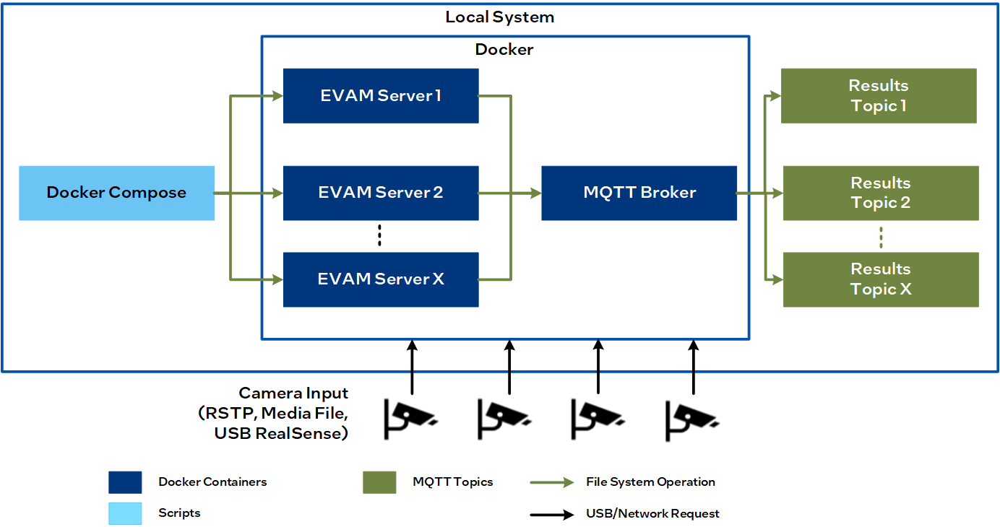

# Automated Self-checkout Retail Reference Implementation

{Before using this template, read the accompanying [overview template
guide](overview-template-guide)}.

## Overview

The Automated Self-Checkout Reference Implementation provides critical components required to build and deploy a self-checkout use case using Intel® hardware, software, and other open source software. This reference implementation provides a pre-configured automated self-checkout pipeline optimized for Intel® hardware.

### Features and Benefits

With this reference implementation, the self-checkout stations can:

* Recognize the non-barcoded items faster.
* Recognize the product SKU and items placed in transparent bags.
* Reduce the steps involved in identifying products when there is no exact match (top five choices)

## How It Works

<!-- Architecture Diagram?? -->

In this reference implementation, the video streams from various cameras are cropped and resized to enable the inference engine to run the associated models. The object detection and product classification features identify the SKUs during checkout. The bar code detection, text detection, and recognition features further verify and increase the accuracy of the detected SKUs. The inference details are then aggregated and pushed to the enterprise service bus or MQTT to process the combined results further.

Figure 1: Automated Self-checkout Functional Diagram

### Edge Video Analytics Microservice

Edge Video Analytics Microservice (EVAM) is a Python-based, interoperable containerized microservice for the easy development and deployment of video analytics pipelines. It is built on [GStreamer](https://gstreamer.freedesktop.org/documentation/) and [Intel® Deep Learning Streamer (DL Streamer)](https://dlstreamer.github.io/), which provide video ingestion and deep learning inferencing functionalities, respectively.

### Automated Self Checkout Pipeline Config

Each automated self-checkout pipeline has a pre-configured setup optimized for running on Intel hardware. The following are the available pipelines: 

*   ``yolov5``: yolov5 object detection only
*   ``yolov5_effnet``: yolov5 object detection and ``efficientnet_b0`` classification
*   ``yolov5_full``: yolov5 object detection, ``efficientnet_b0`` classification, text detection, text recognition, and barcode detection

## Learn More

-   Get started with the Automated Self-check Retail Reference Implementation using the [Get Started
    Guide](Get-Started-Guide.md).
- Learn more about the EVAM in [Edge Video Analytics Microservice - Overview](https://docs.edgeplatform.intel.com/edge-video-analytics-microservice/user-guide/Overview.html).

<!-- To be updated -->
